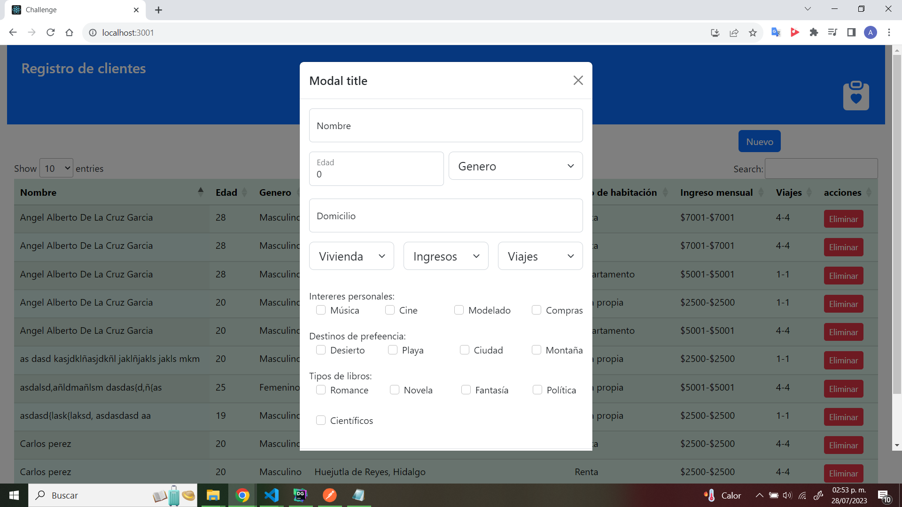
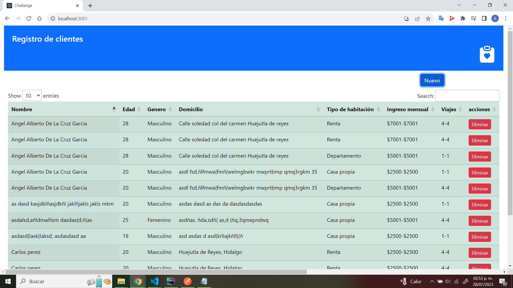

# Aplicacion de React

### Pasos para ejecutar el proyecto
 

* Clonar el proyecto
```
git clone https://github.com/AngelAlbertoDeLaCruzGarcia/FrontClientes.git
```
* Instalar los paquetes
```
npm install
```
* Ejecutar el proyecto
```
npm run dev
```




## Autor

* **Angel Alberto De La Cruz Garcia** - [Linkedin](https://www.linkedin.com/in/angel-alberto-de-la-cruz-garcia-0b445621a/)


